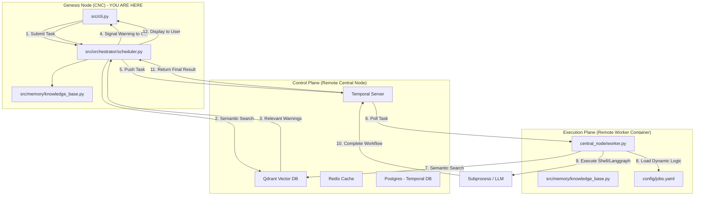

# Architectural Mandate

This system uses a three-plane architecture. You are currently operating on the **Genesis Node (CNC)**.

**CRITICAL RULES:**
1. **CNC Node (Local):** This machine is NOT a worker node. Its role is task delegation and infrastructure provisioning. Do not run any application execution, shell execution, or verification tasks directly on this machine except for performing code changes to the repository.
2. **Worker Node (Remote):** All jobs (e.g., executing terraform, pulumi, cdk, or application code) MUST be sent to the remote worker node via the Temporal queue.
3. **Task Delegation:** Use the Temporal scheduler (`src/orchestrator/scheduler.py`) to delegate tasks.

## System Topology

