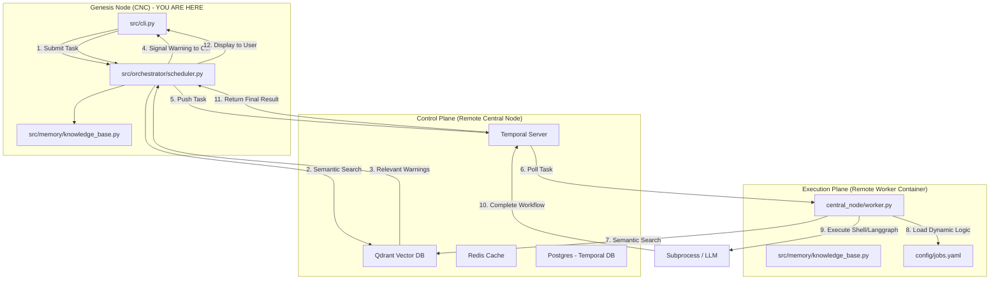

# Architectural Mandate

This system uses a three-plane architecture. You are currently operating on the **Genesis Node (CNC)**.

**CRITICAL RULES:**
1. **CNC Node (Local):** This machine is NOT a worker node. Its role is task delegation and infrastructure provisioning. Do not run any application execution, shell execution, or verification tasks directly on this machine except for performing code changes to the repository.
2. **Worker Node (Remote):** All jobs (e.g., executing terraform, pulumi, cdk, or application code) MUST be sent to the remote worker node via the Temporal queue.
3. **Task Delegation:** Use the Temporal scheduler (`src/orchestrator/scheduler.py`) to delegate tasks.

## System Topology

## Agent Intelligence & Workflow Orchestration

### 1. Plan Mode Default
- Enter plan mode for ANY non-trivial task (3+ steps or architectural decisions)
- If something goes sideways, STOP and re-plan immediately - don't keep pushing
- Use plan mode for verification steps, not just building
- Write detailed specs upfront to reduce ambiguity

### 2. Subagent Strategy
- Use subagents liberally to keep main context window clean
- Offload research, exploration, and parallel analysis to subagents
- For complex problems, throw more compute at it via subagents
- One tack per subagent for focused execution

### 3. Self-Improvement Loop
- After ANY correction from the user: update `tasks/lessons.md` with the pattern
- Write rules for yourself that prevent the same mistake
- Ruthlessly iterate on these lessons until mistake rate drops
- Review lessons at session start for relevant project

### 4. Verification Before Done
- Never mark a task complete without proving it works
- Diff behavior between main and your changes when relevant
- Ask yourself: "Would a staff engineer approve this?"
- Run tests, check logs, demonstrate correctness

### 5. Demand Elegance (Balanced)
- For non-trivial changes: pause and ask "is there a more elegant way?"
- If a fix feels hacky: "Knowing everything I know now, implement the elegant solution"
- Skip this for simple, obvious fixes - don't over-engineer
- Challenge your own work before presenting it

### 6. Autonomous Bug Fixing
- When given a bug report: just fix it. Don't ask for hand-holding
- Point at logs, errors, failing tests - then resolve them
- Zero context switching required from the user
- Go fix failing CI tests without being told how
- After EVERY git push, you MUST actively monitor the CI/CD pipeline status (e.g., using `gh run list` and `gh run view`). If the pipeline fails, diagnose the trace logs and resolve all issues autonomously until the build is perfectly green.

### 7. L2 Memory Integration (Qdrant)
- For every complex issue, architectural roadblock, or bug that is successfully resolved, you MUST embed the context, symptoms, and the applied fix into the L2 Vector Database (Qdrant).
- Use `KnowledgeBaseClient` to push a synthesized `MemoryEntry` into the `agent_insights` collection.
- This creates a permanent semantic immune system, ensuring future agents naturally retrieve the exact fix if identical tracebacks ever surface.

## Task Management & Organization

1. **Plan First**: Write plan to `tasks/todo.md` with checkable items
2. **Verify Plan**: Check in before starting implementation
3. **Track Progress**: Mark items complete as you go
4. **Explain Changes**: High-level summary at each step
5. **Document Results**: Add review section to `tasks/todo.md`
6. **Capture Lessons**: Update `tasks/lessons.md` after corrections

## Core Principles

- **Simplicity First**: Make every change as simple as possible. Impact minimal code.
- **No Laziness**: Find root causes. No temporary fixes. Senior developer standards.
- **Minimal Impact**: Changes should only touch what's necessary. Avoid introducing bugs.