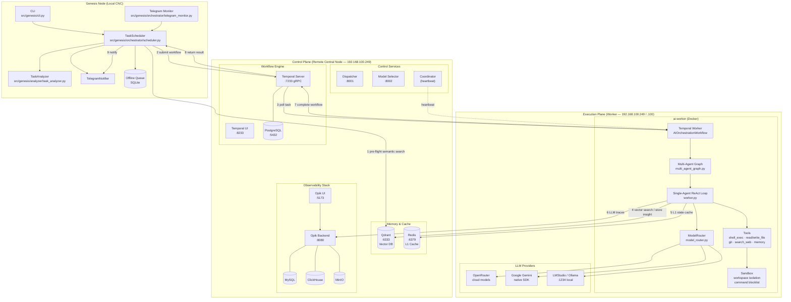
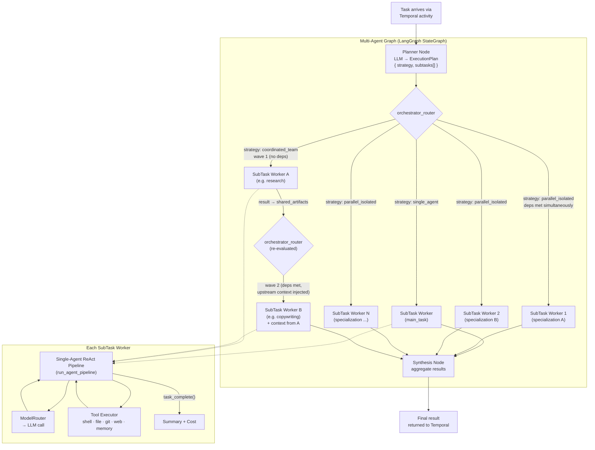
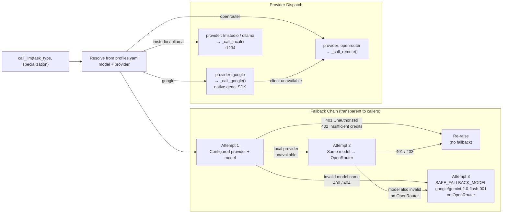
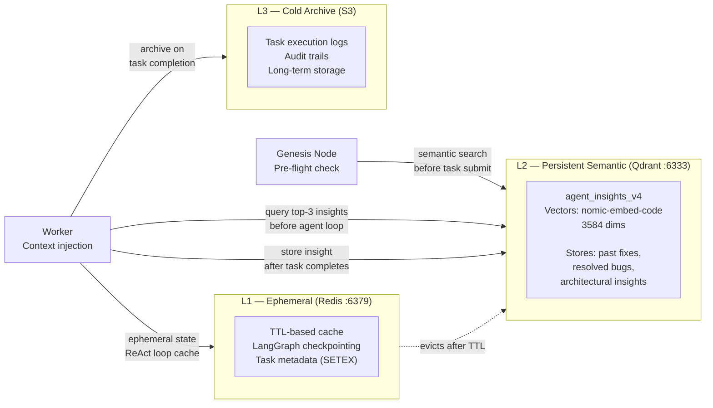
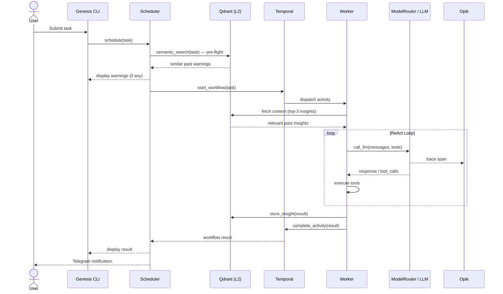

# AI Orchestration System — Architecture

This document describes the current architecture of the AI Orchestration system across its three planes: the **Genesis Node**, the **Control Plane**, and the **Execution Plane**.

---

## System Topology

---

## Multi-Agent Orchestration

When a task arrives at the worker, the **Multi-Agent Graph** decomposes it and routes execution through a dependency-aware pipeline.

---

## Model Router Fallback Chain

Every LLM call in the system goes through `ModelRouter.call_llm()`, which applies a transparent 3-step fallback when configured models fail.

---

## Tiered Memory Architecture

All planes share a three-tier memory system. Reads and writes flow through the `HybridMemoryStore` and `KnowledgeBaseClient`.

---

## Request Lifecycle

---

## Component Reference

| Component | Location | Port | Role |
|---|---|---|---|
| CLI | `src/genesis/cli.py` | — | User-facing task submission |
| Telegram Monitor | `src/genesis/orchestrator/telegram_monitor.py` | — | Headless task intake |
| TaskScheduler | `src/genesis/orchestrator/scheduler.py` | — | Pre-flight + Temporal client |
| TaskAnalyzer | `src/genesis/analyzer/task_analyzer.py` | — | Task type detection |
| Temporal Server | Control Plane | 7233 (gRPC) | Workflow lifecycle |
| Temporal UI | Control Plane | 8233 | Workflow visibility |
| PostgreSQL | Control Plane | 5432 | Temporal state store |
| Qdrant | Control Plane | 6333 (HTTP) | L2 vector memory |
| Redis | Control Plane | 6379 | L1 ephemeral cache |
| Opik Backend | Control Plane | 8080 (HTTP) | LLM trace ingestion |
| Opik Frontend | Control Plane | 5173 | Trace visualization UI |
| Dispatcher | `src/control/dispatcher/dispatcher.py` | 8001 | Task-type routing |
| Model Selector | `src/control/model_selector/selector.py` | 8002 | Model capability matching |
| Coordinator | `src/control/coordinator/coordinator.py` | — | Worker heartbeat aggregation |
| ai-worker | `src/execution/worker/worker.py` | — | Temporal worker + ReAct agent |
| Multi-Agent Graph | `src/execution/worker/multi_agent_graph.py` | — | LangGraph planner + workers |
| ModelRouter | `src/execution/worker/model_router.py` | — | LLM dispatch + fallback chain |
| Tools | `src/execution/worker/tools.py` | — | Agent toolset (15+ tools) |
| Sandbox | `src/execution/worker/sandbox.py` | — | Workspace isolation + blocklist |
| HybridMemoryStore | `src/shared/memory/hybrid_store.py` | — | L1/L2/L3 unified interface |
| KnowledgeBaseClient | `src/shared/memory/knowledge_base.py` | — | Semantic search + embedding |
