# AI Orchestration Project - Architecture

This document describes the three-plane architecture of the AI Orchestration system: the **Genesis Node** (CNC), the **Control Plane**, and the **Execution Plane**.

## 🏗️ System Topology

```mermaid
graph TD
    subgraph "Genesis Node (CNC)"
        Main[src/cnc/main.py]
        CLI[src/cnc/cli.py] --> Scheduler[src/cnc/orchestrator/scheduler.py]
        Scheduler --> KB_Client_CNC[src/shared/memory/knowledge_base.py]
        Scheduler --> OfflineDB[(Offline SQLite DB)]
        Scheduler --> Notifier[Telegram Notifier]
        Backup[src/cnc/orchestrator/backup_manager.py] --> SystemBackups[(Local Backups)]
    end

    subgraph "Control Plane (Remote Central Node)"
        Temporal[Temporal Server]
        Qdrant[Qdrant Vector DB]
        Redis[Redis Cache]
        Postgres[Postgres - Temporal DB]
        LiteLLM[LiteLLM Proxy]
        Dispatcher[src/control/dispatcher/dispatcher.py]
        Catalog[src/control/catalog/catalog.py]
        DAG_Service[src/control/dag/dag_service.py]
        Model_Selector[src/control/model_selector/selector.py]
        Scaler[src/control/scaler/scaler.py]
        Coordinator[src/control/coordinator/coordinator.py]
    end

    subgraph "Execution Plane (Remote Worker Container)"
        Worker[src/execution/worker/worker.py]
        KB_Client_Worker[src/shared/memory/knowledge_base.py]
        Jobs_Config[config/jobs.yaml]
    end

    %% Initialization & Pre-flight Flow
    CLI -- 1. Submit Task --> Scheduler
    Scheduler -- 2. Semantic Search (with LRU Cache) --> Qdrant
    Qdrant -- 3. Relevant Warnings --> Scheduler
    Scheduler -- 4. Interactive Warning to CLI --> CLI
    Scheduler -- 5. Push Task (or Queue Offline) --> Temporal
    Scheduler -- Alerts --> Notifier

    %% Execution Flow
    Temporal -- 6. Poll Task --> Worker
    Worker -- 7. Semantic Search --> Qdrant
    Worker -- 8. Load Dynamic Logic --> Jobs_Config
    Worker -- 9. Execute Shell --> Result[Subprocess]
    Worker -- 9a. Unified AI Call --> LiteLLM
    LiteLLM -- 9b. Model Response --> Worker
    Result -- 10. Complete Workflow --> Temporal
    Worker -- 10. Complete Workflow --> Temporal
    Temporal -- 11. Return Final Result --> Scheduler
    Scheduler -- 12. Display to User & Notify --> CLI
    
    %% Backup Flow
    Backup -. Scheduled Snapshot .-> Qdrant
    Backup -. Scheduled Backup .-> Postgres
```

## 🛠️ Components Description

### 1. Genesis Node (CNC)
*   **Role:** Task Orchestration & Human-in-the-Loop.
*   **Key Action:** Performs the **Pre-flight Check**. Before sending any task to the remote workers, it queries the Knowledge Base (Qdrant) with an LRU cache to identify historical failures. It intercepts the flow to interactively warn the operator.
*   **Offline Resilience:** Uses a local SQLite database (`offline_queue.db`) to queue tasks when the Central Node is unreachable.
*   **Notifications:** Uses `TelegramNotifier` to push real-time status updates (submitted, offline, complete, failed).
*   **Data Safety:** The `BackupManager` orchestrates snapshots of Qdrant and Temporal Postgres.

### 2. Control Plane (Central Node)
*   **Role:** State Management & Networking.
*   **Temporal:** Manages the lifecycle of long-running workflows, ensuring reliability and retries.
*   **LiteLLM:** Acts as the unified proxy/gateway for all LLM calls across the control and execution planes, abstracting provider APIs (OpenAI, Anthropic, Gemini).
*   **Qdrant:** Stores the semantic knowledge base as high-dimensional vectors (gemini-embedding-001).
*   **Redis:** Provides L1 ephemeral caching for fast context retrieval.

### 3. Execution Plane (Worker Node)
*   **Role:** High-Privilege Execution.
*   **Worker:** A containerized agent that executes tasks. It is **Data-Driven**, meaning it does not have hardcoded logic. Instead, it dynamically loads its task definitions from `config/jobs.yaml`.
*   **Execution Guardrail:** Like the CNC node, the worker performs its own internal KB lookup before starting a subprocess, ensuring that even if the CNC pre-flight is bypassed, the execution remains context-aware.
